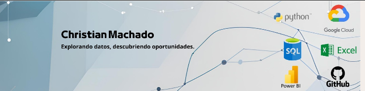

        <!-- Asegúrate de que la ruta coincida con donde subiste la imagen -->
        
    

    

    <h1> CHRISTIAN MACHADO </h1>
    <h3> BI ANALYST, DATA ENGINEER </h3>

<a href="https://instagram.com/secpal_mp" target="_blank">

    

</a>
    

    <strong>
        <ul style="list-style-type: none; padding-left: 0; margin: 0;">
            <li>🏦 Currently working in IT Consulting with focus on:</li>       
            <li style="margin-top: 10px;">
                <strong>Marketing KPIs & Growth:</strong>
                <ul style="list-style-type: '→ '; padding-left: 24px; margin-top: 6px; margin-bottom: 8px;">
                    <li>CAC (Customer Acquisition Cost)</li>
                    <li>CTR (Click-Through Rate)</li>
                    <li>CPL (Cost per Lead)</li>
                </ul>
            </li>            
            <li style="margin-top: 10px;">
                <strong>Sales Analytics:</strong>
                <ul style="list-style-type: '→ '; padding-left: 24px; margin-top: 6px; margin-bottom: 8px;">
                    <li>MRR/ARR (Monthly/Annual Recurring Revenue)</li>
                    <li>Win Rate (% deals closed)</li>
                    <li>Average Sales Cycle Length</li>
                </ul>
            </li>            
            <li style="margin-top: 10px;">
                <strong>Data & Analytics:</strong>
                <ul style="list-style-type: '→ '; padding-left: 24px; margin-top: 6px; margin-bottom: 8px;">
                    <li>Data Freshness ("CRM updates hourly")</li>
                    <li>Query Optimization (% runtime reduction)</li>
                </ul>
            </li>            
            <li style="margin-top: 14px;">🤔 Daily use of: Python, SQL, PowerBI</li>
            <li style="margin-top: 6px;">🌱 Currently learning: Azure, ETL, Data Modeling</li>
        </ul>
    </strong>

     <h2>Areas of Expertise</h2>

    
✅ <strong>Data Quality & Governance</strong>

    
✅ <strong>Marketing Funnel Analytics</strong>

    
✅ <strong>CRM Data Analytics</strong>

    
✅ <strong>Economic Impact Modeling</strong>

    
✅ <strong>Performance Optimization</strong>

    
✅ <strong>Opportunity Pipeline Dashboards</strong>

<h2>Career Highlights</h2>

            <strong>
        <ul style="list-style-type: none; padding-left: 0; margin: 0;">
            <li>IT Network Analyst | Claro Perú (Jul 2024 - Jan 2025)</li> 
                

                        
Data-Driven Operational Optimization: Designed Power BI dashboards tracking response times and failure recurrence, improving decision-making speed by 30%.

                        
Process Automation: Developed Python scripts for automated ticket classification, reducing processing time by 90% with ML(NLP)

                        
Database Performance: Optimized SQL databases, achieving 40% faster query execution and ensuring 99.9% data accuracy in reports.

            <li>BI Analyst | Grupo M4G (Feb 2025 - Currently)</li> 
                

                        
Deliver periodic reports and communicate insights to non-technical stakeholders.

                        
Identify trends using basic ML models.

                        
Build interactive dashboards  to track CAC, CTR, MRR, Win Rate, and other KPIs.

    <h2>Programming languages</h2>

 
  &emsp;
    

  </a>
  &emsp;
    
  </a> 

<h2> Data Analytics & BI Tools<picture>   </picture> </h2>

 
  &emsp;
    

  </a>
  &emsp;
    
  </a> 
  &emsp;
    
  </a>

    <h2>Databases</h2>

 
  &emsp;
    

  </a>
  &emsp;
    
  </a> 

